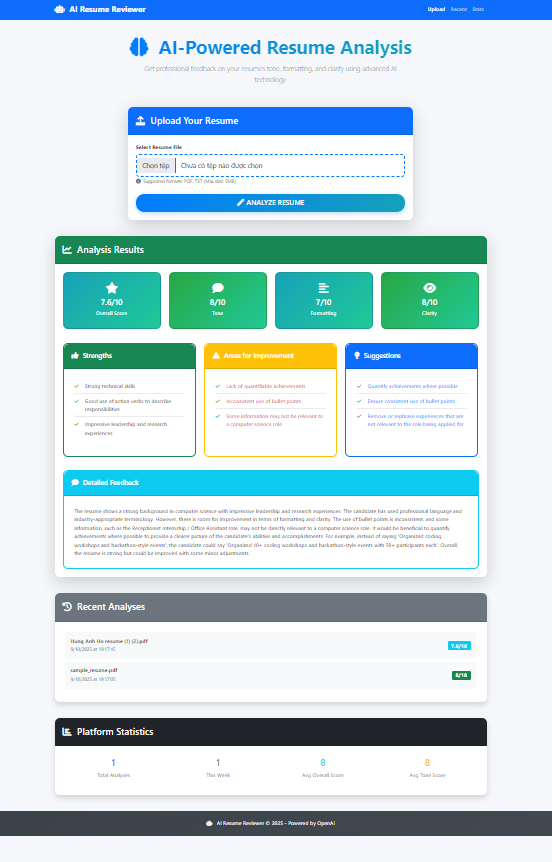

# AI Resume Reviewer

A powerful AI-driven application that analyzes resumes for tone, formatting, and clarity using OpenAI's GPT models. The app provides detailed feedback and suggestions to help improve resume quality.



## Tech Stack

- **Backend**: Node.js, Express.js
- **Database**: MongoDB with Mongoose
- **AI Service**: OpenAI API (GPT-4)
- **Frontend**: HTML5, CSS3, JavaScript, Bootstrap 5
- **File Processing**: PDF parsing, text extraction
- **Security**: Helmet, CORS, Rate limiting

## Prerequisites

- Node.js (v14 or higher)
- MongoDB (local or cloud instance)
- OpenAI API key

## Installation

1. **Clone the repository**
   ```bash
   git clone <repository-url>
   cd ai-resume-reviewer
   ```

2. **Install dependencies**
   ```bash
   npm install
   ```

3. **Set up environment variables**
   ```bash
   cp .env.example .env
   ```
   
   Edit `.env` file with your configuration:
   ```env
   NODE_ENV=development
   PORT=3000
   MONGODB_URI=mongodb://localhost:27017/ai-resume-reviewer
   OPENAI_API_KEY=your_openai_api_key_here
   OPENAI_MODEL=gpt-4
   MAX_TOKENS=2000
   MAX_FILE_SIZE=5242880
   ALLOWED_FILE_TYPES=application/pdf,text/plain
   RATE_LIMIT_WINDOW_MS=900000
   RATE_LIMIT_MAX_REQUESTS=10
   ```

4. **Start MongoDB**
   Make sure MongoDB is running on your system or use a cloud service like MongoDB Atlas.

5. **Start the application**
   ```bash
   # Development mode with auto-restart
   npm run dev
   
   # Production mode
   npm start
   ```

6. **Access the application**
   Open your browser and navigate to `http://localhost:3000`

## API Endpoints

### Resume Analysis
- `POST /api/resume/analyze` - Upload and analyze a resume
- `GET /api/resume/analysis/:id` - Get analysis by ID
- `GET /api/resume/recent` - Get recent analyses
- `DELETE /api/resume/analysis/:id` - Delete an analysis
- `GET /api/resume/stats` - Get platform statistics

### Health Check
- `GET /api/health` - Check API status

## Usage

1. **Upload Resume**: Select a PDF or TXT file using the upload form
2. **AI Analysis**: The system extracts text and sends it to OpenAI for analysis
3. **View Results**: Get detailed scores and feedback on:
   - **Tone**: Professional language and confidence level
   - **Formatting**: Structure, organization, and presentation
   - **Clarity**: Readability, conciseness, and relevance
4. **Review Suggestions**: Implement the AI-generated recommendations
5. **Track Progress**: View analytics and previous analyses

## Project Structure

```
ai-resume-reviewer/
├── models/
│   └── Resume.js              # MongoDB schema
├── routes/
│   └── resume.js             # API routes
├── services/
│   ├── openaiService.js      # OpenAI integration
│   └── textExtractionService.js # File processing
├── middleware/
│   ├── upload.js             # File upload handling
│   └── errorHandler.js       # Error management
├── public/
│   ├── index.html           # Frontend HTML
│   ├── css/
│   │   └── style.css        # Custom styles
│   └── js/
│       └── app.js           # Frontend JavaScript
├── server.js                # Main application file
├── package.json            # Dependencies and scripts
└── .env                    # Environment variables
```

## Configuration

### Environment Variables

| Variable | Description | Default |
|----------|-------------|---------|
| `NODE_ENV` | Environment mode | `development` |
| `PORT` | Server port | `3000` |
| `MONGODB_URI` | MongoDB connection string | `mongodb://localhost:27017/ai-resume-reviewer` |
| `OPENAI_API_KEY` | OpenAI API key | Required |
| `OPENAI_MODEL` | OpenAI model to use | `gpt-4` |
| `MAX_TOKENS` | Maximum tokens for AI response | `2000` |
| `MAX_FILE_SIZE` | Maximum upload file size (bytes) | `5242880` (5MB) |
| `ALLOWED_FILE_TYPES` | Comma-separated allowed MIME types | `application/pdf,text/plain` |
| `RATE_LIMIT_WINDOW_MS` | Rate limiting window | `900000` (15 minutes) |
| `RATE_LIMIT_MAX_REQUESTS` | Max requests per window | `10` |

### File Upload Limits

- **Maximum file size**: 5MB
- **Supported formats**: PDF, TXT
- **Text length**: 50-50,000 characters after extraction

## Security Features

- **Rate Limiting**: Prevents API abuse
- **File Validation**: Checks file type and size
- **Helmet**: Security headers
- **CORS**: Cross-origin request handling
- **Input Validation**: Sanitizes user inputs

## Error Handling

The application includes comprehensive error handling for:
- File upload errors
- AI service failures
- Database connection issues
- Validation errors
- Rate limiting violations

## Testing

```bash
# Run tests
npm test

# Run tests in watch mode
npm run test:watch
```

## Deployment

### Production Setup

1. Set `NODE_ENV=production`
2. Use a production MongoDB instance
3. Configure proper rate limiting
4. Set up SSL/HTTPS
5. Use a process manager like PM2

### Docker Deployment

```dockerfile
FROM node:16-alpine
WORKDIR /app
COPY package*.json ./
RUN npm ci --only=production
COPY . .
EXPOSE 3000
CMD ["npm", "start"]
```

## Contributing

1. Fork the repository
2. Create a feature branch
3. Make your changes
4. Add tests if applicable
5. Submit a pull request

## License

This project is licensed under the MIT License - see the LICENSE file for details.

## Support

For support or questions:
- Create an issue in the repository
- Check the documentation
- Review the error logs

## Roadmap

- [ ] User authentication and profiles
- [ ] Resume comparison features
- [ ] Integration with job boards
- [ ] Additional file format support
- [ ] Real-time collaboration
- [ ] Mobile app development